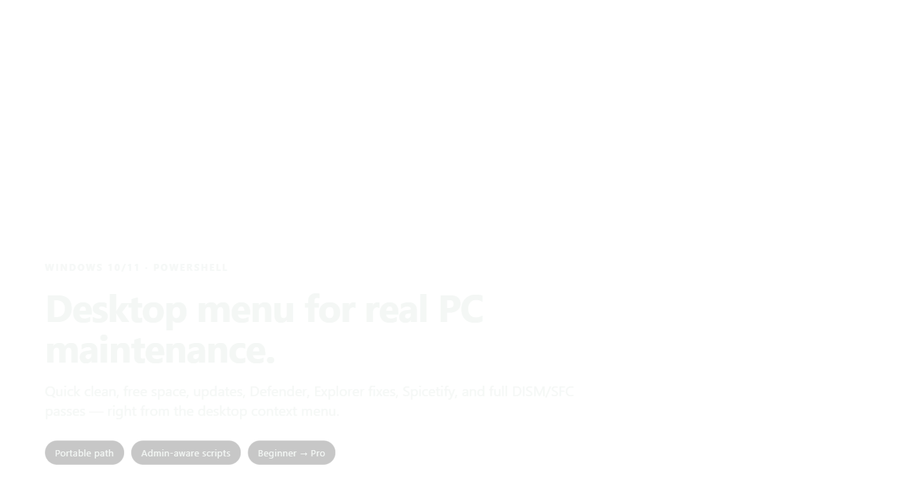
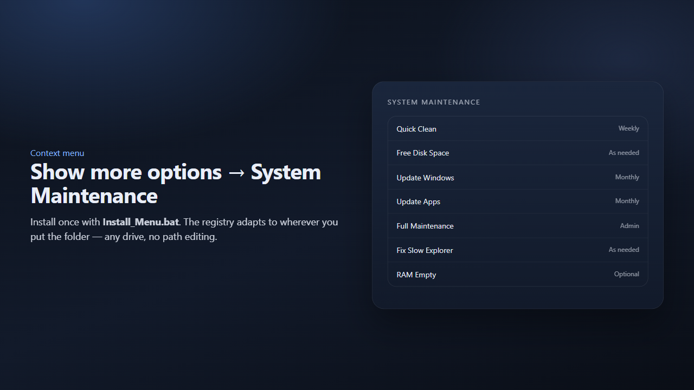
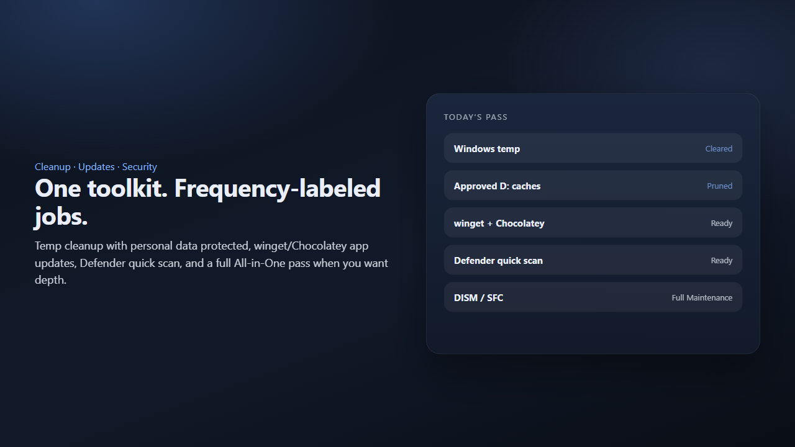
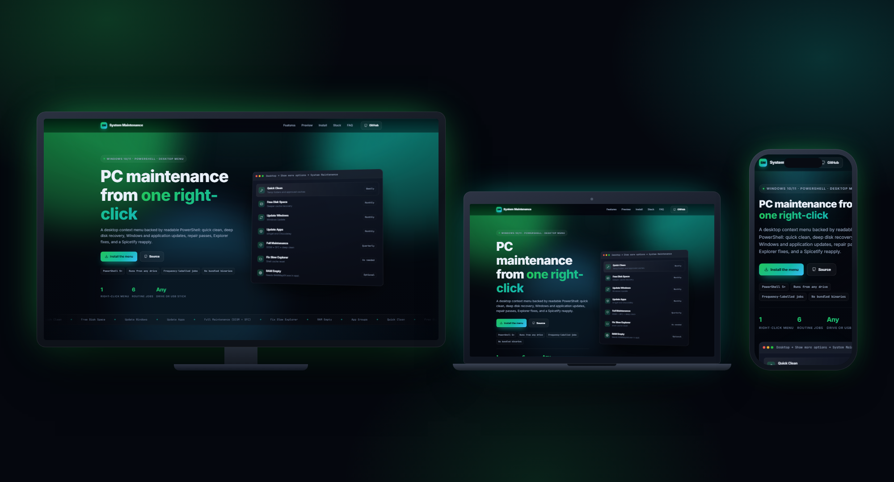
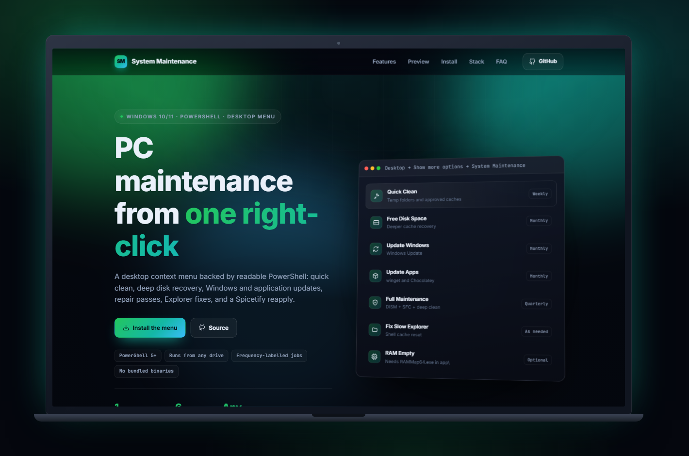
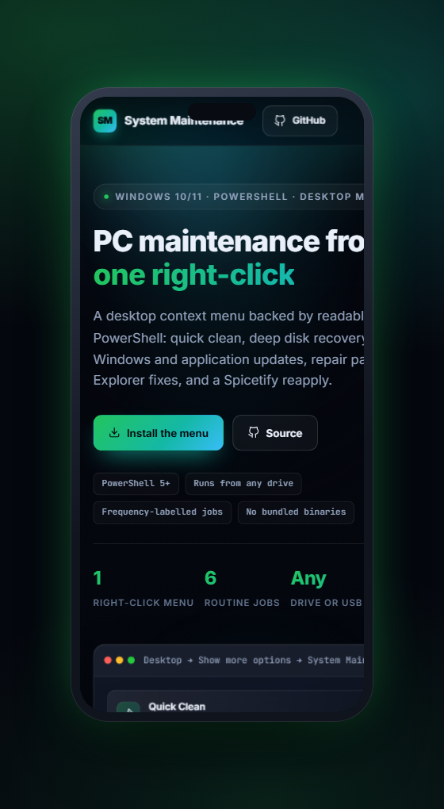
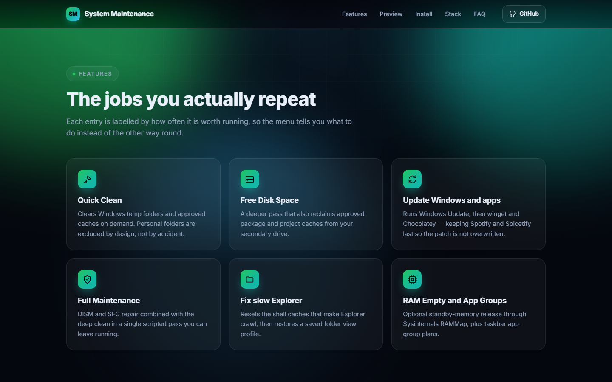
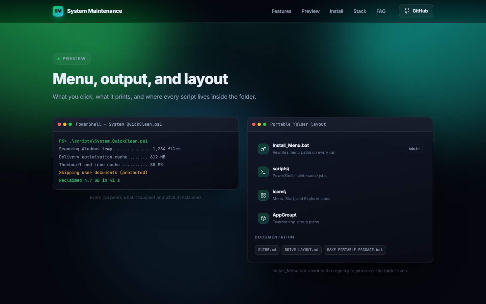
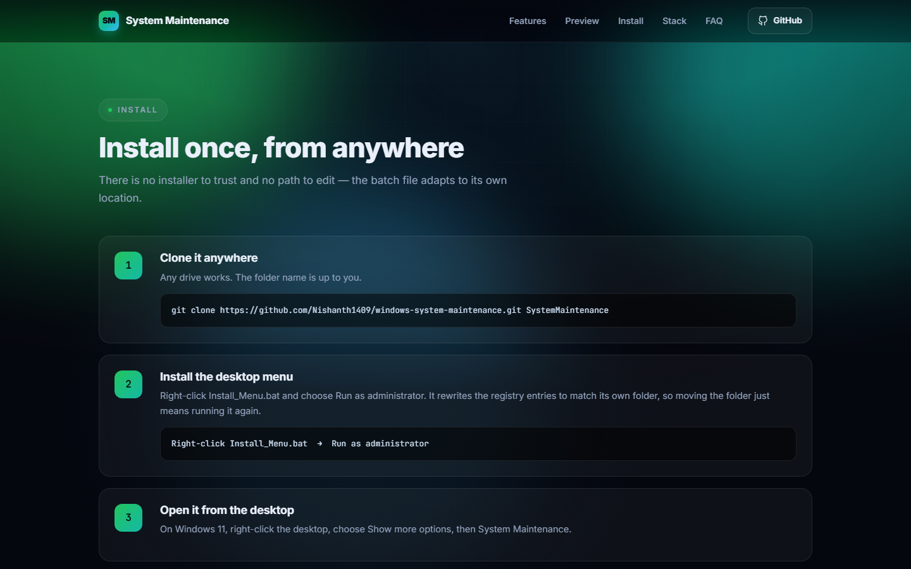

<div align="center">

# Windows System Maintenance

**Desktop right-click menu + PowerShell** for cleanup, updates, security scans, Explorer fixes, Spicetify, and related PC care.

[](https://www.microsoft.com/windows)
[](https://learn.microsoft.com/powershell/)
[](#-getting-started)

[**Live site →**](https://nishanth1409.github.io/windows-system-maintenance/)

</div>

<div align="center">
  
</div>

---

## Why this exists

Most “PC cleaner” tools are noisy, opaque, or locked to one install path. **System Maintenance** is a transparent toolkit you own: frequency-labeled jobs on the desktop context menu, scripts you can read, and a folder that works from any drive.

> Built by **Nishanth K R** — *son of a farmer, always a farmer.*

**Related repos:** [windhawk-mods](https://github.com/Nishanth1409/windhawk-mods) · [youtube-music-float-dock](https://github.com/Nishanth1409/youtube-music-float-dock) · [vlc-folder-audio](https://github.com/Nishanth1409/vlc-folder-audio)

---

## What you can do

| Level | You get |
| :--- | :--- |
| **Beginner** | One desktop menu: clean, update, free space, security |
| **Intermediate** | Admin + user maintenance scripts, Spicetify reapply |
| **Pro** | App Groups, portable package, custom icons, full `GUIDE.md` |

- **Quick Clean** — Windows temp + approved caches (personal data protected).
- **Free Disk Space** — deeper cleanup including approved D: package/project caches.
- **Update Windows / Apps** — Windows Update; winget + Chocolatey (Spotify + Spicetify last).
- **Full Maintenance** — DISM / SFC + deep clean (`System_AllInOne.bat`).
- **Fix Slow Explorer** — plus a preserved folder view profile.
- **RAM Empty** — optional Sysinternals RAMMap (`app\RAMMap64.exe`, not redistributed).
- **NVIDIA / Spicetify / App Groups** — submenu and helper scripts when you need them.

---

## Preview

<div align="center">
  
  <p><em>Desktop → Show more options → System Maintenance.</em></p>
</div>

<div align="center">
  
  <p><em>Cleanup, updates, and security — labeled by how often you run them.</em></p>
</div>

---

## Tech stack

| Layer | Technology |
| --- | --- |
| Menu | `.reg` + `Install_Menu.bat` (path-adaptive) |
| Scripts | PowerShell 5+ · `.bat` launchers |
| Docs | `GUIDE.md` · `DRIVE_LAYOUT.md` |
| Icons | Custom Start / Explorer / NVIDIA assets under `icons\` |

---

## Getting started

### Requirements

- Windows 10/11 · PowerShell 5+ · Admin for menu install and some scripts

### Clone (any drive)

```bash
git clone https://github.com/Nishanth1409/windows-system-maintenance.git SystemMaintenance
```

`Install_Menu.bat` rewrites the menu registry to match its own location — no path editing. If you move the folder, re-run it.

### Install the desktop menu

1. Right-click `Install_Menu.bat` → **Run as administrator**  
2. On Windows 11: desktop → right-click → **Show more options** → **System Maintenance**

### Optional

- Put Sysinternals **RAMMap64.exe** in `app\` for **RAM Empty** (download from Microsoft; not in this repo).  
- Build a USB copy with `MAKE_PORTABLE_PACKAGE.bat`.

### Daily use

| Goal | Action |
| :--- | :--- |
| Quick clean | Menu → Quick Clean |
| Free disk space | Menu → Free Space / Clean Drive |
| Windows update | Menu → Update Windows |
| App updates | Menu → Update Apps |
| Full pass | Menu → Full Maintenance |
| Empty standby RAM | Menu → RAM Empty |

Or run scripts directly:

```powershell
powershell -NoProfile -ExecutionPolicy Bypass -File .\scripts\System_QuickClean.ps1
```

### Layout

| Path | Purpose |
| :--- | :--- |
| `Install_Menu.bat` / `Add_Desktop_Menu.reg` | Context menu |
| `System_*.bat` | Menu launchers |
| `scripts\` | PowerShell maintenance |
| `icons\` | Menu & custom icons |
| `AppGroup\` | Taskbar app-group plans |
| `GUIDE.md` | Full reference |

### Safety

- Review scripts before running on a new machine.  
- Elevate only when the guide/menu says so.  
- No third-party EXE redistributables in this repo.  
- `app\` and `logs\` are gitignored.

## License

Personal / portfolio use. Review before commercial reuse.

---

## Project site

A full walkthrough is published as a project site — the feature set, preview panels, and the
install guide, all on one page.

<div align="center">
  
  <p><em>The project site on television, laptop, and phone.</em></p>
</div>

| Laptop · 1440 × 900 | Phone · 390 × 844 |
| :---: | :---: |
|  |  |

<div align="center">
  
  <p><em>Every feature, one card at a time.</em></p>
</div>

<div align="center">
  
  <p><em>Preview panels — what it looks like in use.</em></p>
</div>

<div align="center">
  
  <p><em>The install guide, step by step.</em></p>
</div>

---

## Live & credits

| | |
| :--- | :--- |
| **Live** | [nishanth1409.github.io/windows-system-maintenance](https://nishanth1409.github.io/windows-system-maintenance/) |
| **Author** | [Nishanth K R](https://github.com/Nishanth1409) |
| **Repo** | [Nishanth1409/windows-system-maintenance](https://github.com/Nishanth1409/windows-system-maintenance) |
| **Portfolio** | [nkrportfolio.vercel.app](https://nkrportfolio.vercel.app) |

---

<div align="center">

*Son of a farmer · always a farmer.*

[GitHub](https://github.com/Nishanth1409) · [Portfolio](https://nkrportfolio.vercel.app)

</div>
